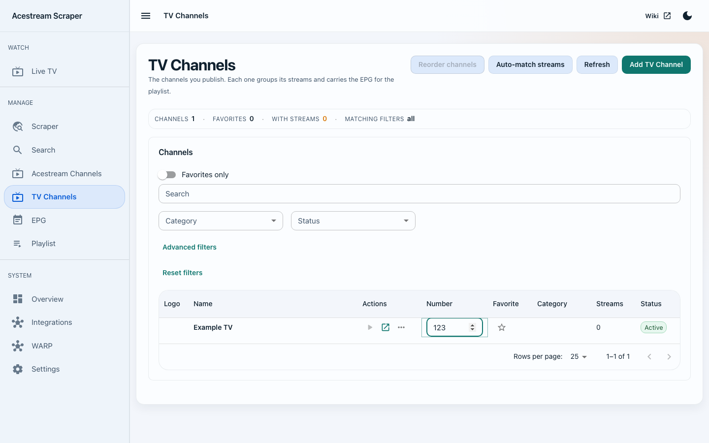
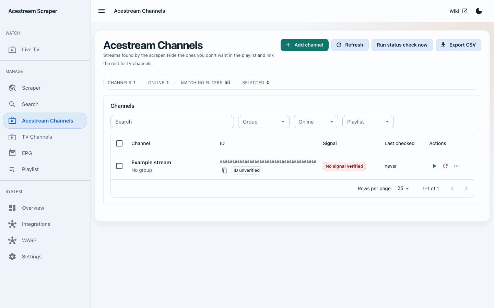

# V2 user-documentation review — 8 September 2026

Source baseline: `develop` at `7a4381f` (PR #188). This is a dated review, not a release sign-off or a statement of current CI status. Recheck the running deployment and latest source before launch. The test instance was inspected through its browser UI; its deployed image digest was not independently matched to the checkout.

## Scope and evidence

Headless Chromium visited Overview, Live TV, Scraper, Search, Acestream Channels, TV Channels, EPG, Playlist, Integrations, WARP and all four Settings tabs. Initial navigation recorded no JavaScript page errors or HTTP responses of 400 or greater. The test instance reported playback/checking engines, Acexy, IPFS, ZeroNet and WARP running. External media-server/player cards were inspected without changing their configuration or sending playback to other devices.

Opened Add URL, channel reorder preview, advanced filters and the inline playlist format editor. The example source form was not submitted; reorder was cancelled. Screenshots under `wiki/usage-*.png` were captured from the running UI, with private URLs/content IDs masked where relevant. The obsolete QR image was removed because generated QR codes can embed access credentials. The phone capture uses a 390 × 844 viewport in dark theme; desktop captures use 1440 × 1000 (some full-page).

Live TV reached Playing and displayed video on one test. A later attempt did not reach Playing within a 55-second observation window. This pass does not establish reliable startup for every stream or identify the cause of that timeout. A further bounded attempt had not produced a decoded frame after 22 seconds. Its catalogue filter preserved the single player-session request, with no page errors. The mobile catalogue measured 390 pixels of document width in a 390-pixel viewport. Test viewers were released using Stop watching. Use the troubleshooting guide and runtime diagnostics to investigate recurrent startup failures.

## Documentation corrections

- Current Settings tab names/deep links, public address in Integrations, optional engines and dedicated checker behavior.
- TV-channel numbering, favorites, catalogue-wide filters and complete-order preview/save/cancel.
- Live TV layout, programme schedule, stream/audio choice, direct send and mobile use.
- Stable station relay versus individual content-ID relay, unassigned playlist tail and client-dependent recovery.
- Signal verification versus engine ID lookup; persisted scheduled-job outcomes.
- Backup-first startup recovery, correct health/diagnostic endpoints and per-service log retention (including checker).
- ARMv7 community engine details and outstanding hardware verification, without outdated Premium-only claims or unsupported resource promises.
- Wiki sidebar/help navigation and repository document links that survive the flattened wiki mirror.

## Docker builder review

The page already offered a bundled checker toggle but had no separate checker-state mount and could emit the conflicting external checker variable. It now makes those selections exclusive, adds the conditional state mount, exposes the optional playback-engine default, and emits host-gateway mapping for external engine/checker addresses using `host.docker.internal`. Next steps link to the current setup and troubleshooting workflows.

Validation completed:

- `bash scripts/ci/validate_command_builder.sh`: runtime schema/platform/settings contract and JavaScript syntax passed.
- Local Playwright browser checks: all 12 flavor/platform combinations; checker on/off and external selection transitions; checker storage; external host mapping; full-service environment/volumes/capabilities; develop tags; Compose output tab; 390-pixel mobile page width; no page errors.
- README/wiki relative-link audit: paths, Markdown anchors and image destinations passed. Repository-document links use the develop source URL rather than nonexistent wiki page names.
- `bash scripts/ci/publish_wiki.sh --dry-run`: flattened pages and assets rendered successfully; no external publish performed.
- `bash scripts/ci/assert_no_legacy_paths.sh --strict` and `git diff --check`: passed.

The full backend/frontend application suites, image builds, ARM hardware playback, destructive recovery, automatic relay-failure injection and external-player/media-server end-to-end playback were not part of this documentation pass.

## Follow-up observations

- At 1440 pixels, the TV Channels Number fields show cramped/clipped floating labels in compact rows; some long signal labels are ellipsized in Acestream Channels. The screenshots preserve the actual UI; these are candidates for a separate UI polish pass.
- The sampled guide contained overlapping entries for a station. Source data versus mapping/import behavior was not isolated; verify the chosen XMLTV source and station mapping before treating it as an application defect.
- Repeated playback startup should be exercised with runtime logs before launch. One successful video session is not a stability test, and this review did not verify decoder continuity during relay failover.

## Follow-up implementation — 9 September 2026

- TV Channels uses its Number column header as the visible table label, retaining the channel-specific accessible input name; phone fields retain their visible label. Signal chips wrap when necessary and the desktop signal column has room for the longest status.
- XMLTV import previously only matched exact channel/time/title keys, accumulating old entries when schedules changed. Refresh now removes superseded listings only where valid incoming programmes cover that source/channel. Gaps, other sources and absent channels remain; empty or invalid intervals do not erase listings. Existing duplicate keys within refreshed coverage are consolidated. Overlap present in the incoming provider feed remains visible rather than being silently guessed away.
- Embedded Alembic startup previously reconfigured root logging and disabled existing application loggers. Startup now preserves logging so playback failures can be diagnosed after migrations.
- A failed player-status request previously stopped polling indefinitely. Transient failures now keep polling, display an actionable error and recover automatically; missing/unauthorized sessions stop polling. Playing/Buffering/Paused reflect browser media events. Startup-timeout copy no longer assumes that no peers exist.

The earlier captured Acexy log contains an upstream response-header timeout during a failed start. That establishes an upstream failure for that attempt, not a universal cause for every blank player. A new three-attempt browser check could not begin because the test instance refused connections. These code changes have not been deployed there. Repeated live startup and decoder continuity through relay failover remain unverified; deterministic player/relay tests do not establish real-world stream availability.

Validation after the follow-up fixes:

- Full canonical suite with preinstalled dependencies: 1,242 backend tests passed, 3 skipped; 4 documentation contract tests passed; 73 frontend suites / 415 tests passed; OpenAPI/client generation drift checks, frontend lint/typecheck and production build passed.
- The initial sandboxed run blocked local sockets, process inspection and shell file descriptors; the complete rerun with those permissions passed.

- Full responsive suite: all 60 checks passed across phone/desktop Chromium, small-phone WebKit and tablet Firefox, in both themes. Tests use isolated fixtures, including playback lifecycle, audio choice, routing, startup recovery and the new channel-label checks. Updated stale playback-button selectors and phone scrolling expectations. E2E typecheck passed.
- Command-builder contract, strict legacy-path check, 153 README/wiki local links/anchors, wiki publish dry run and diff whitespace checks passed.

The following reviewed screenshots show the updated frontend with synthetic example data, not the live instance. The earlier wiki walkthrough screenshots remain the live capture record.

