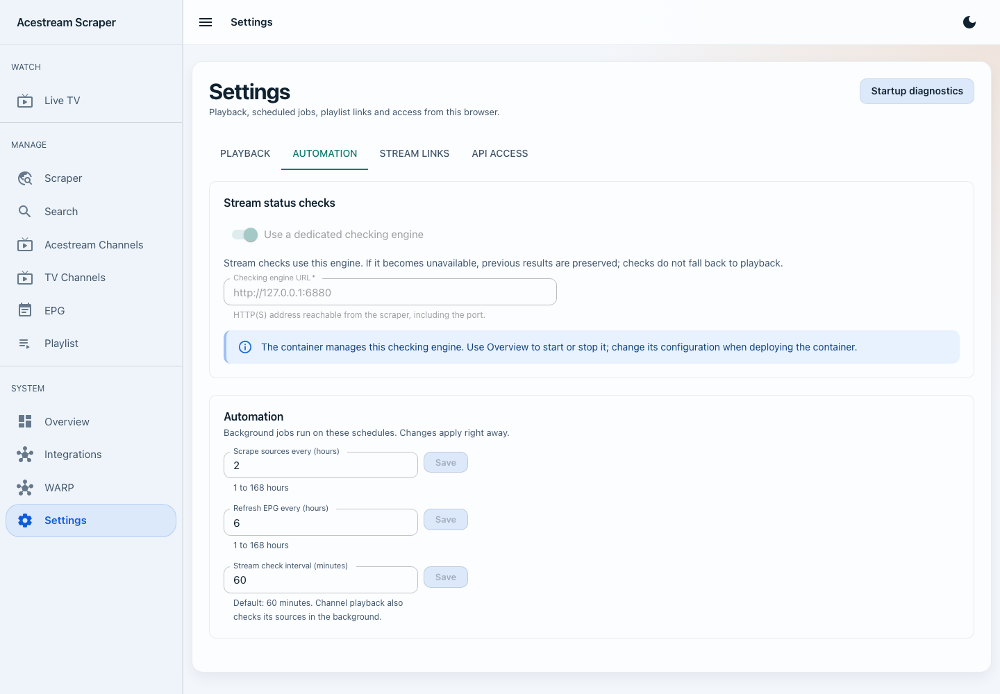
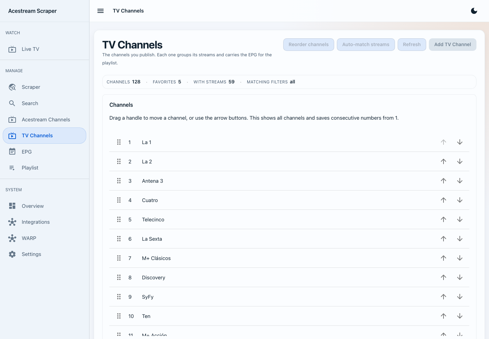
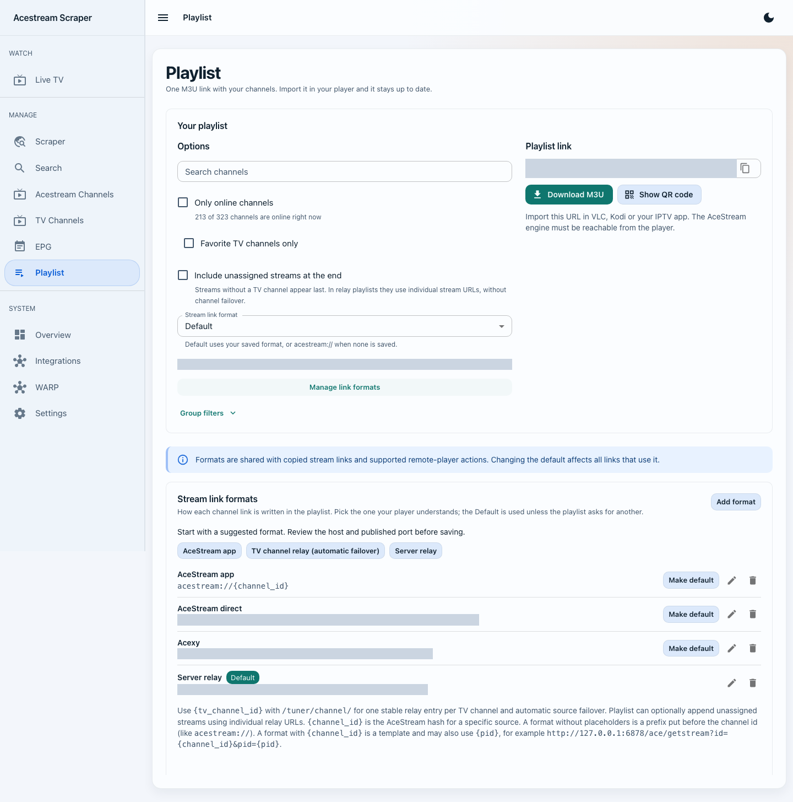
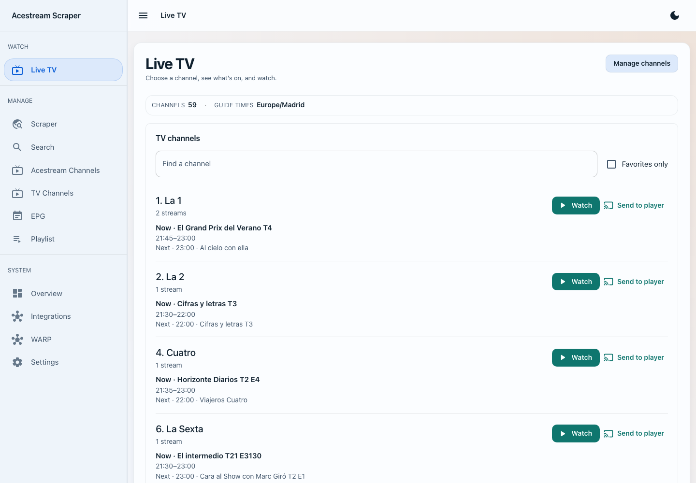

# Using Acestream Scraper v2

This walkthrough starts with a running container and ends with a playlist you can open in VLC, Kodi, or an IPTV app. Screenshots were refreshed from a running v2 test installation on 8 September 2026. Addresses and source URLs are hidden where needed; your catalogue and enabled services will differ.

## Before you begin

Open `http://localhost:8000` (replace `localhost` with the Docker host's address when using another device).

If you have not created the container yet, use the [Docker command builder](https://pipepito.github.io/acestream-scraper/). It asks about your CPU, engine, proxy, and optional services, then produces a ready-to-copy `docker run` command or `docker-compose.yml`. The [project README](https://github.com/Pipepito/acestream-scraper#readme) gives the short v2 overview; the [Installation Guide](Installation.md) and [Docker Guide](Docker.md) contain the full details.

## Find your way around

Navigation groups **Watch** (Live TV), **Manage** (sources, Search, stream and TV inventories, EPG, Playlist), and **System** (Overview, Integrations, WARP, Settings). The top-left button collapses the sidebar on desktop and opens the menu on a phone. The theme button switches between light and dark.

A **stream** is one AceStream content ID. A **TV channel** groups stream IDs for one station, with its channel number, favorite flag and programme guide. Scraping discovers streams; assigning them to TV channels creates the viewing catalogue.

## Step 1: Check the Overview

The **Overview** page is the first place to check after startup. Its status line shows whether the AceStream engine is reachable, how many streams and TV channels are loaded, and when scraping and EPG refresh last ran.

The **Services** section distinguishes three states:

- **Running**: enabled and answering.
- **Not running**: installed in the selected image but disabled or unhealthy.
- **Not installed**: unavailable in the selected image flavor or platform.

The inventory and scheduled-jobs sections show what is loaded and when automation runs next. Engines are optional: a scraper-only installation can manage sources and playlists without one. Browser playback and engine search need a reachable playback engine; status checks need a playback or dedicated checking engine.

The playback and checking engines have separate Start, Stop and Restart controls. Stop pauses automatic engine recovery until Start/Restart or a container restart. **Download diagnostics** collects recent scraper and service logs. Scheduled jobs retain their last launch and result across restarts; an unfinished run is marked interrupted.

## Step 2: Configure playback, checks and links

Open **Settings**. Its four tabs can be bookmarked independently:

| Tab | Use it for |
|---|---|
| **Playback** (`/settings?tab=playback`) | Save the optional engine URL reachable from the backend. A bundled engine normally uses `http://localhost:6878`. Optionally enable **Route playback through Acexy** and save its backend-facing URL. This does not start Acexy and applies to new sessions. |
| **Automation** (`/settings?tab=automation`) | Choose a dedicated checking engine and save source-scrape, EPG-refresh and stream-check intervals. Changes apply immediately. A bundled checker is read-only here; its controls are in Overview. |
| **Stream links** (`/settings?tab=links`) | Add named player formats, choose the default, and set optional PID/AppID compatibility flags. The same editor is available in Playlist. |
| **API access** (`/settings?tab=access`) | Store the server's `API_TOKEN` in this browser, if one is configured. This does not set or change the server token. |

Set the address other devices use in **Integrations → Public address**. A backend engine URL may use `localhost` when it shares the container; a link opened on another device must use the server's reachable address.

Without a dedicated checker, checks use the saved playback engine. With neither configured they are skipped without changing channel results. A dedicated checker outage never falls back to playback.

## Step 3: Add and scrape a source

Open **Scraper**, select **Add URL**, and enter a page or feed that contains AceStream links.

1. Choose **Auto-detect** unless you know the source type.
2. Use **Regular HTTP** for normal web pages, **ZeroNet** for ZeroNet content, or **IPFS** for `ipfs://`, `ipns://`, and gateway content that should be fetched through the configured IPFS gateway.
3. Keep the source **Enabled** so scheduled scrapes include it.
4. Turn on **Harvest bare content IDs** only when the source lists raw 40-character hashes without `acestream://` links.

With **Auto** or **IPFS**, `inbrowser.link` IPFS/IPNS links are fetched through
`IPFS_GATEWAY_URL` (default `http://127.0.0.1:8081` inside the container).
The browser gateway relies on a service worker and cannot serve scraper requests
like a normal HTTP gateway. Enable IPFS or configure a reachable HTTP gateway.
Native `ipns://<name>/path` links use the same route. An explicit **Regular HTTP**
selection preserves direct HTTP fetching.

Plain `.txt` lists with alternating channel-name and 40-character ID lines are
recognized automatically, preserving their names. Malformed hashes are skipped.
Unstructured bare hashes on other pages still require **Harvest bare content IDs**.
Select **Add**, then use the row's **Scrape** action. **Scrape all** processes every enabled source.

The table records the last result, last run, and number of channels found. If a source fails, its error remains visible there.

## Step 4: Review discovered streams

Open **Acestream Channels**. This is the stream inventory populated by scraping or engine search.

1. Filter by name, group, online state, or playlist visibility.
2. Use the circular-arrow action to check one stream, or **Run status check now** for the current inventory.
3. Open the row's **More actions** menu to assign a stream to a TV channel.
4. Open the row menu to edit, hide/show in playlists, mark its TV channel as a favorite, or delete it.
5. Use **Export CSV** when you need an inventory snapshot.

Hiding a stream keeps it in the database but excludes it from generated playlists.

## Step 5: Organize streams into TV channels

Open **TV Channels**. A TV channel is the user-facing station in your playlist; it can group primary and backup AceStream IDs and carry one EPG identity.

1. Select **Add TV Channel** and enter its name and optional metadata.
2. Open the channel after creation.
3. Add one or more streams, or paste multiple IDs in bulk.
4. Set its EPG ID or link it from the EPG workflow.
5. Use the **Favorite** star in the table or phone card. Edit **Number** and press Enter or leave the field to save; blank clears it.
6. Search, Category, Status and Favorites stay visible. **Advanced filters** holds the remaining filters and shows an active count. Filters apply to the whole catalogue before pagination.
7. Choose **Reorder channels** to see the complete catalogue. Drag the handles or use arrow/keyboard controls to preview consecutive numbers from 1. **Save order** commits the full order; **Cancel** leaves stored numbers unchanged. If another edit makes the inventory stale, reload it before trying again.

To fill existing TV channels from scraped streams, select **Auto-match streams**
then **Find matches**. This checks all TV channels, including those outside the
current filters. Results are grouped by TV station with a count of matching stream IDs.
If the source sites mostly carry one country, choose it under **Assume country
for unlabelled channels** before finding matches. For example, **Spain** treats
unlabelled streams and TV channels as Spanish for this analysis. Explicit country
labels take precedence; stored metadata is unchanged. This fills missing countries,
it does not filter out explicitly labelled foreign channels. The default is
**No assumption**. Changing it clears the preview and selections.

Nothing is selected initially. Select a station or expand its streams and select
individual IDs, then select **Assign selected**. Only full station identities
are shown; uncertain names, editions and conflicting metadata are discarded.
Existing stream assignments are preserved. Ambiguous or
unmatched streams can still be assigned from the channel detail page.

The channel detail page also shows the linked guide's current and upcoming programmes.

## Step 6: Add programme-guide data

Open **EPG**. The five tabs form one workflow:

1. **Sources**: add an XMLTV URL and refresh it.
2. **Channels**: review guide channels and create TV channels from selected unlinked entries.
3. **Matching**: analyze scraped stream names and create matched TV channels in bulk.
4. **Rules**: manage include/exclude patterns used by matching.
5. **Export**: download XMLTV containing only your configured TV channels.

Large imports can continue in the background. Progress and future runs appear on **Overview**.

## Step 7: Build the playlist URL

Open **Playlist**.

1. Optionally filter by channel name.
2. Choose whether to include only online channels or only favorite TV channels.
3. Select a stream link format; **Default** uses the saved default (or `acestream://` if none exists). Expand **Manage link formats** to edit the shared formats without leaving this page.
4. For one stable entry per station with backup sources, add/select **TV channel relay (automatic failover)** using `http://SERVER:8000/tuner/channel/{tv_channel_id}.ts`. **Server relay** with `/tuner/stream/{channel_id}.ts` plays a specific stream and does not provide TV-channel failover.
5. Choose **Include unassigned streams at the end** if desired. In a TV relay playlist these use individual stream URLs, without channel failover.
6. Expand **Group filters** to include or exclude categories.
7. Copy the generated URL or select **Download M3U**.

The canonical player-facing endpoint is `/playlists/m3u`. The web page may generate the equivalent versioned API URL so it can include every selected option.

## Step 8: Import it on another device

Select **Show QR code** to move the generated URL to a phone, TV, or IPTV app without typing it. The player must be able to reach both the web endpoint and the host used in the stream-link format.

The QR code contains the generated URL, including a token when required. Treat it like a credential if API access is protected.

In VLC, choose **Media → Open Network Stream**, paste the playlist URL, and play. Other clients usually call the same action **Add playlist by URL**, **M3U URL**, or **Open network stream**.

## Watch in the browser

Open **Live TV** for active TV channels with assigned streams, current/next programmes and favorite filtering. **Online streams without a channel** has its own search and pagination.

Choose **Watch**. The player and scrollable catalogue stay on the same page. Searching and filtering do not stop playback. **Playback options → Larger player** expands the desktop video area; **Standard player** restores the split. **Schedule** shows the current and upcoming programmes in your device timezone. Select another **Stream** or **Audio track** when available. **Stop watching** releases your viewer.

**Send to player** sends directly to a saved remote player; it does not start browser playback. Players opened on other pages use a dialog. See [Web Player](Web-Player.md) for codec requirements and error messages.

## Search and manual additions

Use **Search** to query the connected AceStream engine catalogue. Add one result or select several and add them together. Use **Add channel** on **Acestream Channels** when you already know a content ID.

Search shows the catalogue's availability and last update separately from the
current broadcast. **Catalogue: available** is an upstream report, not proof of
an emission now. **Check broadcast** opens a temporary engine session for that
infohash, checks increasing P2P downloads and a media sample for identified audio/video packets, then cleans up its session.
It does not add the result to your channels. **No broadcast detected** means the
check could not confirm usable media within its time limit; it is not proof
that a scheduled event or a temporarily unreachable stream will never work.

Saved-channel status checks use the same signal verification. ID lookup (found, not found, unknown) is separate from broadcast status. A timeout or engine outage is not proof that an ID is absent. Online describes the last successful check, not a playback guarantee. A live-type
flag, connected peers, cached download totals, or “got newer download” alone no
longer marks a channel online. Session creation retries once on timeout; data
observation uses the `acestream_check_timeout` setting (10 seconds by default,
capped at 120 seconds), followed by bounded session cleanup.

## API and health endpoints

- Interactive OpenAPI documentation: `http://localhost:8000/docs`
- Public health check: `http://localhost:8000/api/v1/health`
- Player-friendly M3U: `http://localhost:8000/playlists/m3u`
- Versioned playlist API: `http://localhost:8000/api/v1/playlists/m3u`

All current application APIs are under `/api/v1`. A small set of v1 playlist aliases remains so existing players continue to work.

## WARP

Open **WARP** under System, or choose **Manage WARP** in Overview. When installed and enabled, The page shows connection state, mode, account, and exit location, and provides connect/disconnect controls. Enabling WARP in Docker requires `ENABLE_WARP=true`, the `NET_ADMIN` and `SYS_ADMIN` capabilities, and the `/dev/net/tun` device. Set `WARP_ENABLE_NAT=true` to connect automatically, or use the page's connect control. WARP is available on `linux/amd64` and `linux/arm64`; it is unavailable on `linux/arm/v7` because Cloudflare does not publish a 32-bit ARM package.

## Next steps

- [Configuration Reference](Configuration.md)
- [Docker and platform guide](Docker.md)
- [Troubleshooting and startup recovery](Troubleshooting.md)
- [Frequently asked questions](FAQ.md)
- [Bug reporting](Bug-Reporting.md)
