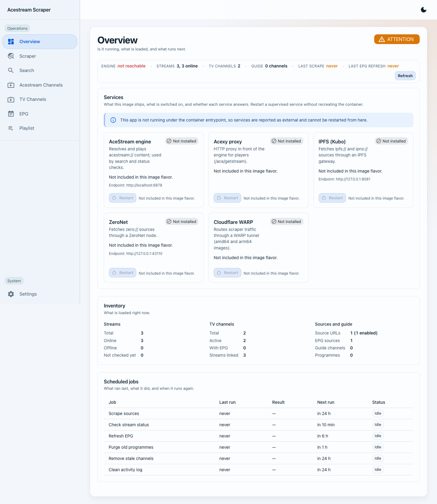
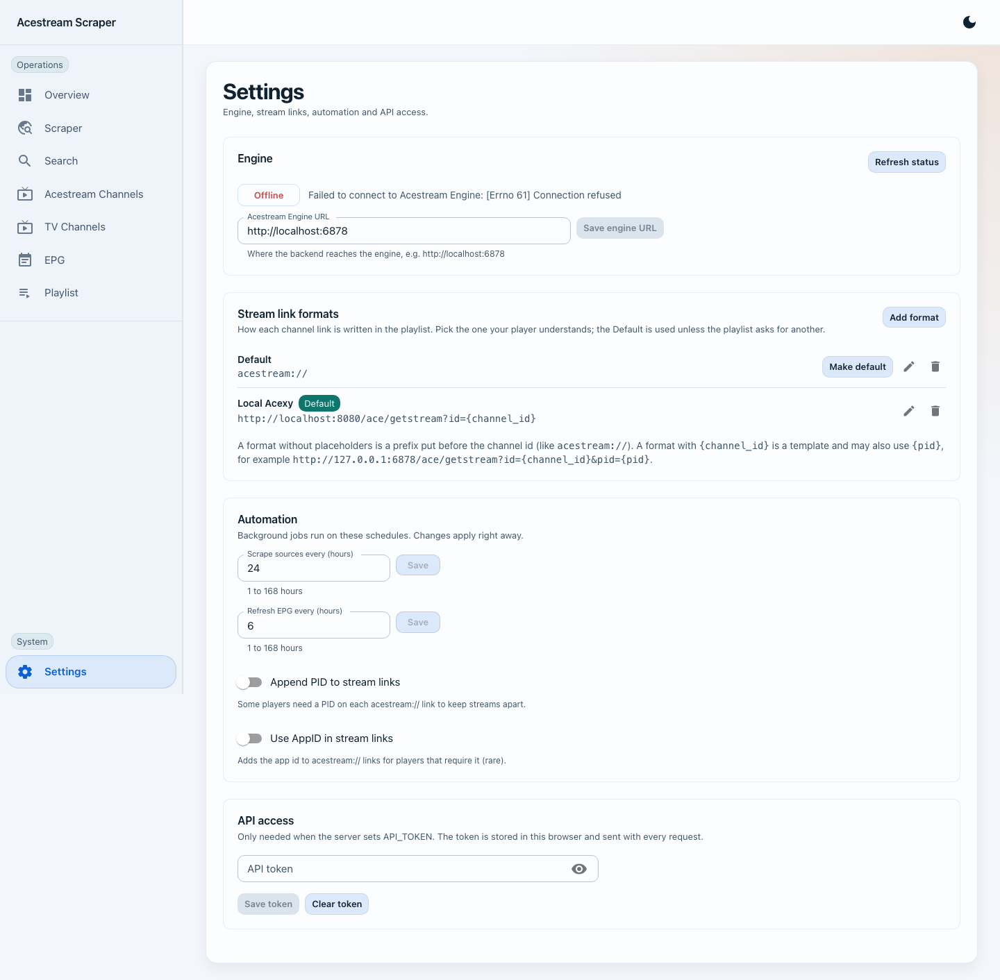
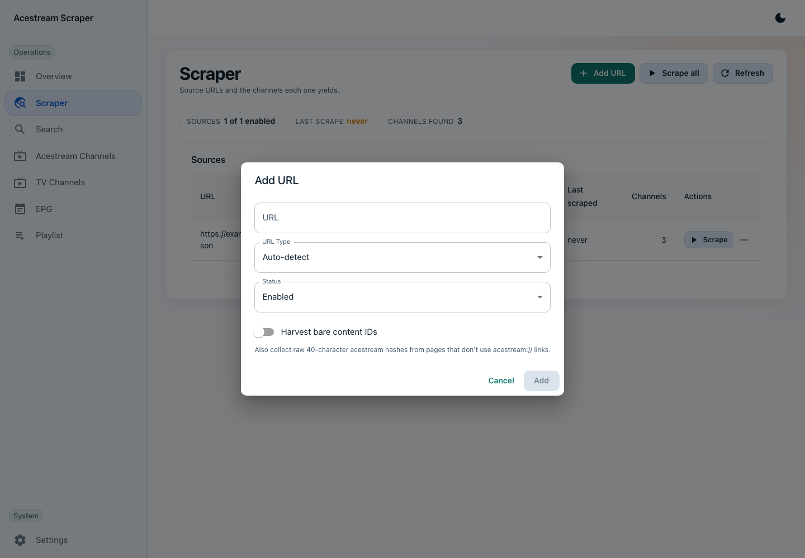
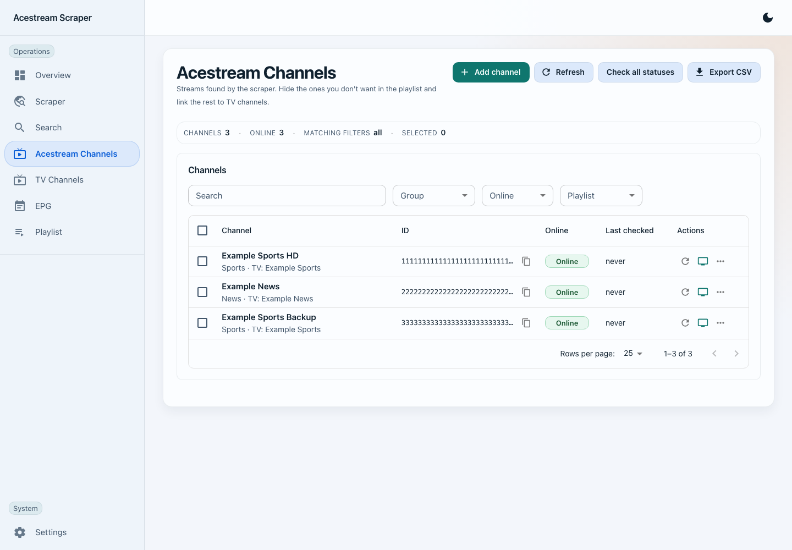
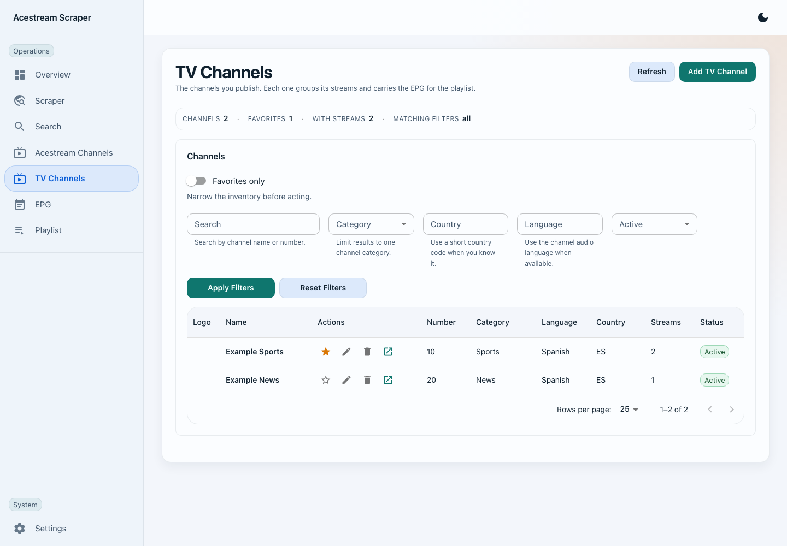
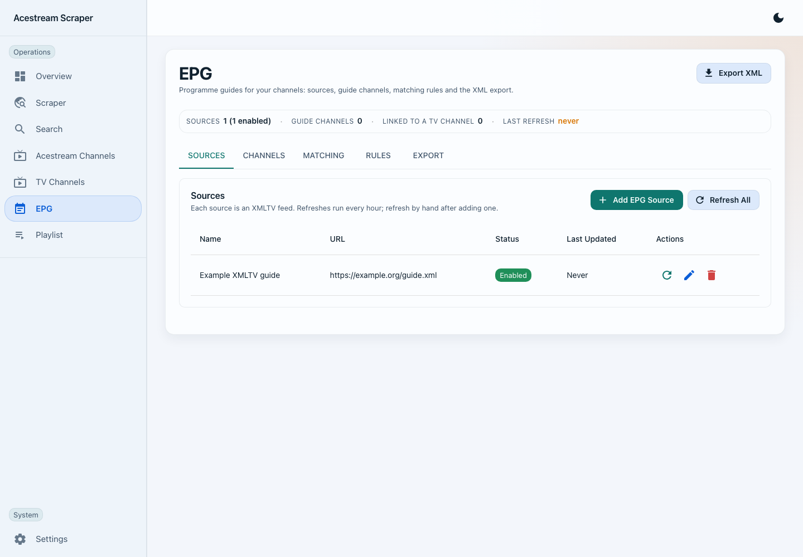
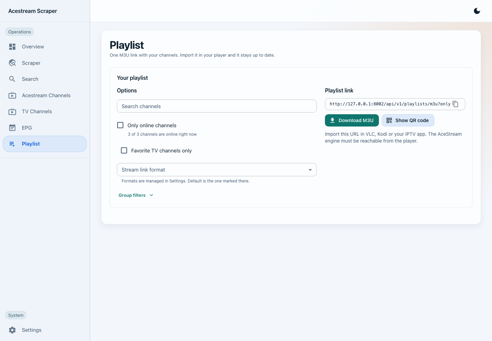
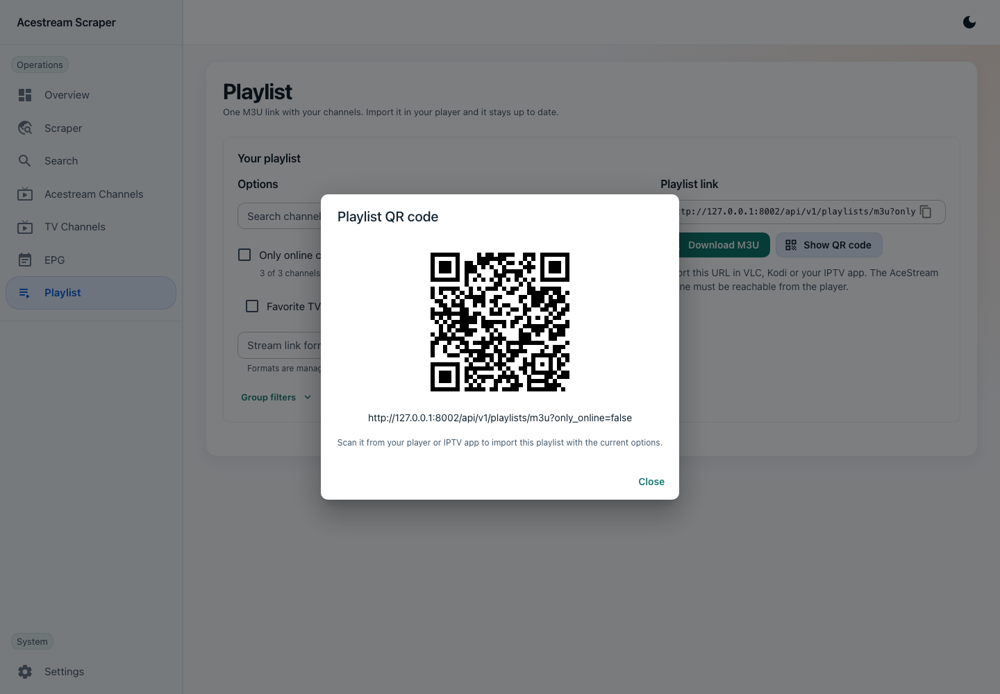

# Using Acestream Scraper v2

This walkthrough starts with a running container and ends with a playlist you can open in VLC, Kodi, or an IPTV app. The screenshots use example data; your sources and channels will be different.

## Before you begin

Open `http://localhost:8000` (replace `localhost` with the Docker host's address when using another device).

If you have not created the container yet, use the [Docker command builder](https://pipepito.github.io/acestream-scraper/). It asks about your CPU, engine, proxy, and optional services, then produces a ready-to-copy `docker run` command or `docker-compose.yml`. The [project README](https://github.com/Pipepito/acestream-scraper#readme) gives the short v2 overview; the [Installation Guide](Installation.md) and [Docker Guide](Docker.md) contain the full details.

## Step 1: Check the Overview

The **Overview** page is the first place to check after startup. Its status line shows whether the AceStream engine is reachable, how many streams and TV channels are loaded, and when scraping and EPG refresh last ran.

The **Services** section distinguishes three states:

- **Running**: enabled and answering.
- **Not running**: installed in the selected image but disabled or unhealthy.
- **Not installed**: unavailable in the selected image flavor or platform.

The inventory and scheduled-jobs sections show what is loaded and when automation runs next. A new installation can show **Attention** until its engine and sources are configured.

## Step 2: Configure the engine and stream links

Open **Settings**.

1. In **Engine**, enter the URL the backend uses to reach the AceStream engine. For the engine bundled in the same container, the default is normally `http://localhost:6878`.
2. In **Stream link formats**, choose how a player reaches a stream. `acestream://` works for players with native protocol support. With Acexy, use a pattern such as `http://SERVER:8080/ace/getstream?id={channel_id}`, replacing `SERVER` with an address the player can reach.
3. Mark the format you want as **Default**.
4. In **Automation**, choose the source-scrape and EPG-refresh intervals.
5. If the container sets `API_TOKEN`, save the same token under **API access** in this browser. Playlist-only clients can use `?token=...` when they cannot send headers.

Do not put `localhost` in a playlist format consumed on another device: there it means the player itself, not your server.

## Step 3: Add and scrape a source

Open **Scraper**, select **Add URL**, and enter a page or feed that contains AceStream links.

1. Choose **Auto-detect** unless you know the source type.
2. Use **Regular HTTP** for normal web pages, **ZeroNet** for ZeroNet content, or **IPFS** for `ipfs://`, `ipns://`, and gateway content that should be fetched through the configured IPFS gateway.
3. Keep the source **Enabled** so scheduled scrapes include it.
4. Turn on **Harvest bare content IDs** only when the source lists raw 40-character hashes without `acestream://` links.
5. Select **Add**, then use the row's **Scrape** action. **Scrape all** processes every enabled source.

The table records the last result, last run, and number of channels found. If a source fails, its error remains visible there.

## Step 4: Review discovered streams

Open **Acestream Channels**. This is the stream inventory populated by scraping or engine search.

1. Filter by name, group, online state, or playlist visibility.
2. Use the circular-arrow action to check one stream, or **Check all statuses** for the current inventory.
3. Use the TV action to assign a stream to a TV channel.
4. Open the row menu to edit, hide/show in playlists, mark its TV channel as a favorite, or delete it.
5. Use **Export CSV** when you need an inventory snapshot.

Hiding a stream keeps it in the database but excludes it from generated playlists.

## Step 5: Organize streams into TV channels

Open **TV Channels**. A TV channel is the user-facing station in your playlist; it can group primary and backup AceStream IDs and carry one EPG identity.

1. Select **Add TV Channel** and enter its name and optional metadata.
2. Open the channel after creation.
3. Add one or more streams, or paste multiple IDs in bulk.
4. Set its EPG ID or link it from the EPG workflow.
5. Mark frequently used channels as favorites if you plan to create a favorites-only playlist.

The channel detail page also shows the linked guide's current and upcoming programmes.

## Step 6: Add programme-guide data

Open **EPG**. The five tabs form one workflow:

1. **Sources**: add an XMLTV URL and refresh it.
2. **Channels**: review guide channels and create TV channels from selected unlinked entries.
3. **Matching**: analyze scraped stream names and create matched TV channels in bulk.
4. **Rules**: manage include/exclude patterns used by matching.
5. **Export**: download XMLTV containing only your configured TV channels.

Large imports can continue in the background. Progress and future runs appear on **Overview**.

## Step 7: Build the playlist URL

Open **Playlist**.

1. Optionally filter by channel name.
2. Choose whether to include only online channels or only favorite TV channels.
3. Select the stream link format configured in **Settings**.
4. Expand **Group filters** to include or exclude categories.
5. Copy the generated URL or select **Download M3U**.

The canonical player-facing endpoint is `/playlists/m3u`. The web page may generate the equivalent versioned API URL so it can include every selected option.

## Step 8: Import it on another device

Select **Show QR code** to move the generated URL to a phone, TV, or IPTV app without typing it. The player must be able to reach both the web endpoint and the host used in the stream-link format.

In VLC, choose **Media → Open Network Stream**, paste the playlist URL, and play. Other clients usually call the same action **Add playlist by URL**, **M3U URL**, or **Open network stream**.

## Search and manual additions

Use **Search** to query the connected AceStream engine catalogue. Add one result or select several and add them together. Use **Add channel** on **Acestream Channels** when you already know a content ID.

## API and health endpoints

- Interactive OpenAPI documentation: `http://localhost:8000/docs`
- Public health check: `http://localhost:8000/api/v1/health`
- Player-friendly M3U: `http://localhost:8000/playlists/m3u`
- Versioned playlist API: `http://localhost:8000/api/v1/playlists/m3u`

All current application APIs are under `/api/v1`. A small set of v1 playlist aliases remains so existing players continue to work.

## WARP

When WARP is installed and enabled, open it from the **Overview** services panel. The page shows connection state, mode, account, and exit location, and provides connect/disconnect controls. Enabling WARP in Docker requires `ENABLE_WARP=true` plus the `NET_ADMIN` and `SYS_ADMIN` capabilities. WARP is available on `linux/amd64` images only.

## Next steps

- [Configuration Reference](Configuration.md)
- [Docker and platform guide](Docker.md)
- [Frequently asked questions](FAQ.md)
- [Bug reporting](Bug-Reporting.md)
